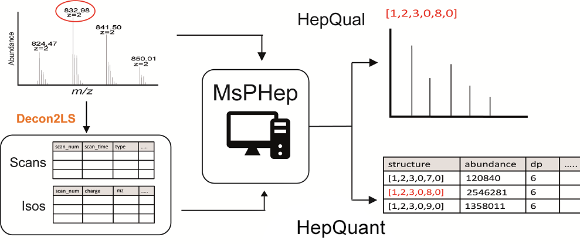

# Welcome to MsPHep &nbsp;

<b>MsPHep</b> is Low Molecular weight heparin (LMWH) analysis tool which is user-friendly and efficiently to evalute LC-MS top-down datasets.

In particluar, <b>MsPHep</b>  include functions:

(1) <b>HepQual:</b> assign structure and isotopic profile from mass to charge (m/z) and charge

(2) <b>HepQuan:</b> extract LMWHs or heparin compositions and abundances automaticallywithout prior knowledge or any database generation.

---

---

# About MsPHep

About MsPHep is publicly available on [GitHub](xxxxx) under a GPL-3 license. 

The web application can be freely accessed for direct online use at [xxxxx](http://glycoeng.sdu.edu.cn/english). 

---

